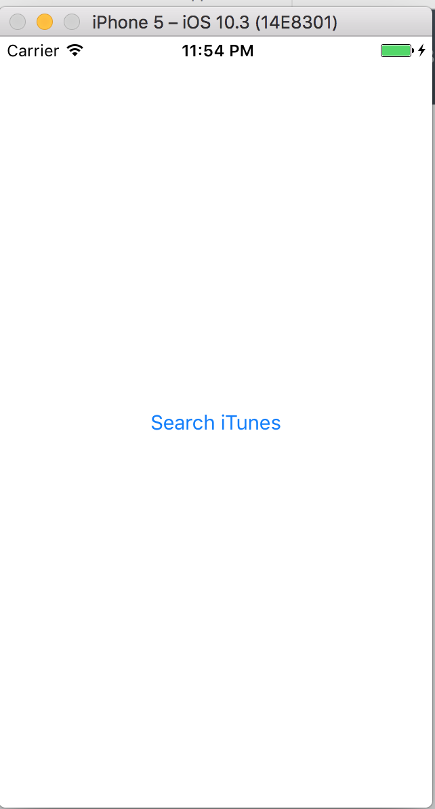
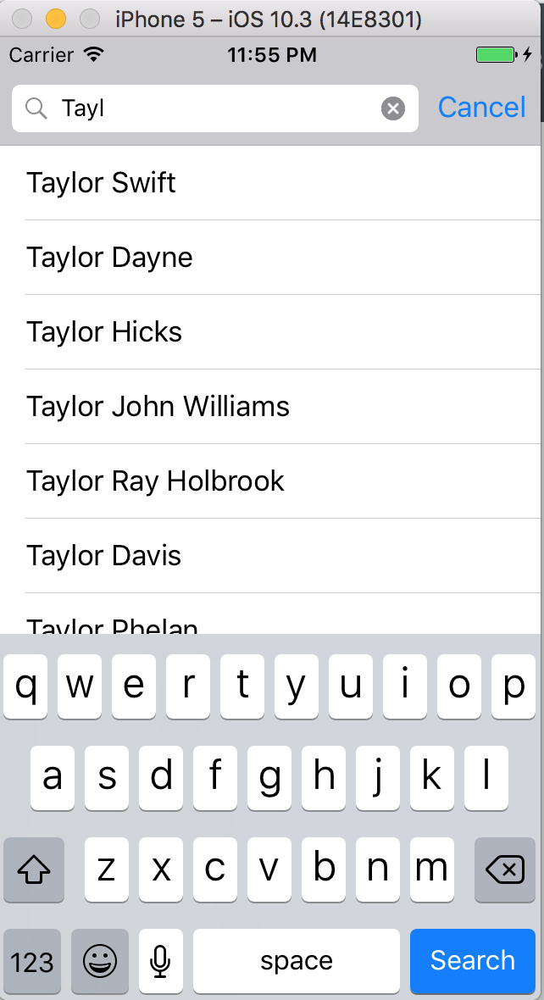
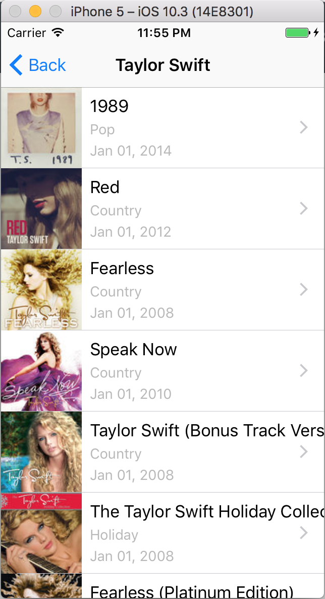
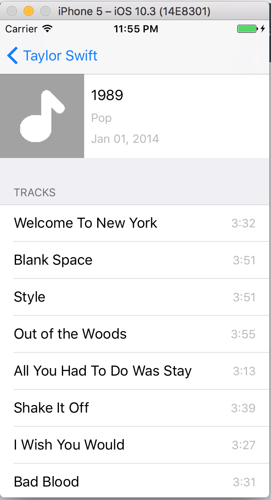

#ItunesSearch

App that allows a user to search for a music artist from the iTunes store and browse the artist's Albums and view the songs in each Album.

Technologies
============

* Code written in Swift 3.0
* Data parsed from [iTunes Search API](https://affiliate.itunes.apple.com/resources/documentation/itunes-store-web-service-search-api/)

Screenshots
===========

